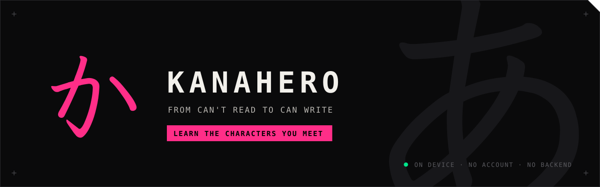
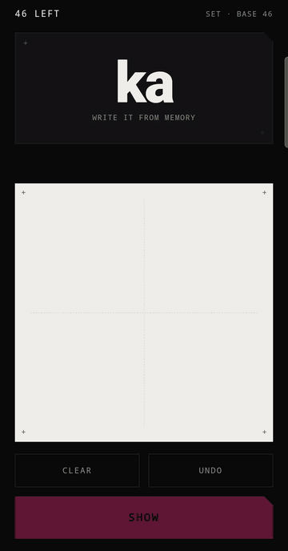
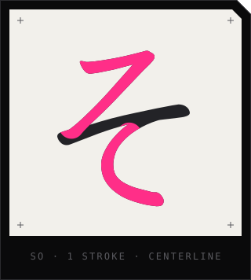
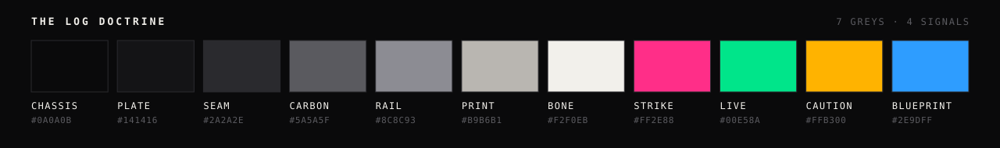

Write kana from memory — all 71 hiragana, all 71 katakana. A romaji prompt, a
blank canvas, and the real stroke order animating over whatever you just drew.
Plus a capture bank: photos of the characters you meet in the wild and cannot
read yet, taken offline and kept until they can be turned into cards.

**Live:** https://kanahero.joeyguierra.com — no account, no install required,
nothing to configure.

It exists because reading kana and writing it are different skills, and every
app that claims to teach the second one quietly teaches tracing instead.

<p align="center">
  
</p>

---

## The loop

```
   ┌─────────────┐
   │   "so"      │   romaji prompt, one card
   └─────────────┘
          │
          ▼
   ┌─────────────┐
   │  ✎          │   you write it by hand. no hint, no outline,
   │             │   no stroke count, no way to skip
   └─────────────┘
          │  flip
          ▼
   ┌─────────────┐
   │  そ    3    │   the real stroke order draws itself over your
   │  strokes    │   attempt, in writing order, at pen speed
   └─────────────┘
          │
          ▼
    got it / missed        you grade yourself. that is the mechanism,
          │                not a shortcut around a missing feature
          ▼
   missed cards requeue 5 positions later and come back
```

A session is the shuffled set — all 71, or the base 46 — of **one** script. It
ends when the queue is empty. There is no session length setting because a
session is not a length, and no mixed deck because あ and ア are two different
things to write.

## The numbers

Home is a switchboard: one card per script, each carrying its own count.

```
    あ  HIRAGANA    38 / 71   ▓▓▓▓▓▓▓▓▓▓▓░░░░░░
    ア  KATAKANA    12 / 71   ▓▓▓░░░░░░░░░░░░░░
    ▣   BANK              23  →
```

A kana joins its set when you grade yourself correct **on its first attempt in
a session**. Get it wrong, get it right on the requeue, and it does not count —
it comes back tomorrow. The set lives in `localStorage` as one versioned blob
and persists mid-session, so a closed tab loses nothing. The scripts score
separately; earning そ tells you nothing about ソ.

Not a percentage. `38 of 71` says what is left to learn; `54%` says how much you
are failing, and invites you to protect a number instead of writing a character.

The bank count is the exception, and the exception is the point: **no
denominator, no bar, no end state.** It is the only unbounded number in the app,
it grows in the field, and its growth is what it is for. That is also why the
entry on Home is a strip and not a fourth track card.

## The bank

You are on an escalator in Osaka and a sign has a character you cannot read.
The loop is: open app → tap `BANK` → tap `CAPTURE` → native camera → shutter →
done. **Two taps in, zero after the shutter** — no confirm screen, no annotate
step. A confirm screen is a place to lose a capture to a closing train door.

```
    capture   <input capture="environment">  →  createImageBitmap
              (EXIF rotation baked in)       →  long edge to 1600px
                                             →  jpeg 0.82  →  IndexedDB
    review    the note is written later, at the hotel: one line, "where I was"
    export    one ZIP  →  navigator.share, anchor-download fallback
```

Photos never touch `kanahero:v1`. The number stays a small `localStorage` blob;
the photos live in their own IndexedDB database (`kanahero-bank`, store
`captures`). Separate failure domains on purpose — a quota failure in one must
not take the other with it. `navigator.storage.persist()` is requested on the
first capture and whatever it answers is reported honestly in the footer, since
persistence is a request and not a guarantee.

Which is why **export is a first-class button, not a settings item.** A trip's
captures are irreplaceable and they live in one browser's site data, subject to
an eviction policy nobody controls. Export writes one ZIP — `captures/<id>.jpg`
plus a `manifest.json` — in STORE mode, by a hand-rolled writer in
[`lib/zip.ts`](lib/zip.ts) with no dependency. It never mutates the bank, so it
is repeatable, and a folder of openable photos is what hand-conversion will
actually need later.

**No OCR.** Captures do not become drillable cards in this build, by any
automatic means. Turning photos into cards is a later build, done by hand.

## Offline

The design constraint is a plane, an underground platform, a night bus. The law,
scoped:

1. **Drilling is fully offline, always.** Cards, stroke SVGs and fonts are
   vendored at build time and precached on install.
2. **Capture is fully offline, always.** Camera, downscale, write, count,
   export — all of it works in airplane mode.
3. **Conversion** (a later build) may touch the network once, at conversion
   time, seated and by choice.
4. **$0 runtime.** No metered API is called by the shipped app, ever.

`scripts/gen-sw.mjs` runs after `next build`: it walks `out/`, and emits a
service worker precaching the whole export — 562 URLs — under a cache named for
the export's content hash. Activate cleans every other `kanahero-*` cache and
claims; fetch is cache-first with the shell as the navigation fallback. A
changed hash quietly becomes current on the next online launch; there is no
update UI. The worker precaches the built app only: never IndexedDB, never
captures, no background sync, no push.

Install fetches per URL rather than with `addAll`, which is atomic: a host that
answers 404 for one entry — `/index.html`, hidden behind a clean-URL rule — must
cost that entry and not the entire offline install. The shell is the one URL
that has to land; without it the install refuses rather than pretending. That
case is covered in `e2e-offline.mjs`, because the failure it prevents looks
exactly like a stuck splash screen on a train.

> The precache is ~15.5 MB, most of it font slices, so the first load needs a
> real connection long enough to finish installing. After that, nothing does.

`vercel.json` deploys this as a plain static site — `"framework": null`, output
`out/`, no clean-URL rewriting. The Next.js preset would run its own build
command, skipping `scripts/gen-sw.mjs` and shipping no service worker at all,
which is a deploy that succeeds and is silently not offline. Turning the preset
off also makes the deployed origin behave exactly like the `serve out` the
verification scripts run against. (`vercel.json` rejects unknown keys, comments
included, which is why this note lives here.)

## What it does not have

| | |
| :-- | :-- |
| Handwriting recognition | Judging your own stroke against the animation is what makes you look closely at it. |
| Hints | No first-stroke peek, no ghost under the canvas, no stroke count before the reveal. A hint converts recall into tracing. |
| Skip | The only way past a card is to write something and grade it. |
| Accounts, sync, backend | The number is worth more when it is yours, on one device. |
| Streaks, goals, notifications | Retention theater. |
| Nav bar, settings | Six screens, one path each. The only choice is 46 vs 71, and it is on Home. |
| OCR on captures | The honest version is hand-conversion, later, on camera. Also what keeps the offline law trivially true. |
| Crop, tags, search, sort | The native camera's zoom is the framing tool. Newest-first is the only order a trip needs. |
| Multi-select or clear-all delete | Bulk destruction of a trip's irreplaceable data is not a button this app offers. |
| Kanji, yōon, vocabulary | The kanji track is designed, not built — the bank is its future feeder. |

The full reasoning, screen map and user flows are in
[`docs/spec/SPEC-v3.md`](docs/spec/SPEC-v3.md), written before any code. It
supersedes [`docs/spec/SPEC.md`](docs/spec/SPEC.md) (v2), which still binds
everything about the writing loop.

## Run it

```sh
npm install
npm run dev            # http://localhost:3000
npm run strokes        # re-vendor + verify the 142 stroke SVGs
npm run build          # static export -> out/, then generates out/sw.js
npm run e2e            # walks the real flows against out/
```

`next.config.ts` sets `output: "export"`. There is no server, no API route and
no runtime fetch — the build is a directory of files, which is exactly what
makes precaching all of it correct.

`scripts/verify-strokes.mjs` is the gate on the stroke data: all 142 present,
every viewBox `0 0 1024 1024`, every file carrying both a shadows group and a
strokes group. The three `e2e-*.mjs` scripts are not a test suite — they are
verification scripts that walk the flows that matter:

| | |
| :-- | :-- |
| `e2e-loop.mjs` | the writing loop, the first-attempt rule, requeue distance, both scripts, persistence across a reload |
| `e2e-bank.mjs` | capture and downscale, the note, delete's two taps, and an export ZIP checked with the system `unzip` and byte-compared to the stored blob |
| `e2e-offline.mjs` | the plane test: with the network cut at the browser, the shell boots, a stroke SVG animates, and a capture saves and survives a reload — plus a hostile host whose 404 must not cost the whole precache |

The service worker needs a secure context, so `e2e-offline.mjs` and any phone
test both have to run over HTTPS or localhost — over a plain LAN IP nothing
registers and there is no offline story.

## Stroke data



The strokes animate the way a pen moves, not as an outline being traced. Each
centerline is revealed start to end, clipped to its own shadow, with a pen-lift
pause between strokes and a duration that scales with path length — a long sweep
takes longer than a tick.

That is possible because the underlying data is centerlines, not glyph outlines:

> Stroke order data: **strokesvg** by zhengkyl (MIT) —
> https://github.com/zhengkyl/strokesvg
>
> SVG paths derived from the **Klee One** font, licensed under the
> SIL Open Font License 1.1 — https://openfontlicense.org/

The upstream NOTICE ships with the app at
[`public/licenses/strokesvg-LICENSE.txt`](public/licenses/strokesvg-LICENSE.txt)
and is fetched by `scripts/fetch-strokes.mjs` alongside the SVGs, so vendoring
the data and vendoring its license are the same step.

The four typefaces the app self-hosts — Klee One, Archivo, JetBrains Mono, Noto
Sans JP — are all SIL OFL 1.1, and their notices plus the licence text are in
[`public/licenses/NOTICE.txt`](public/licenses/NOTICE.txt), which the app links
from its own footer and precaches like everything else.

## Design

Four passes, each made before its build commit and each kept in `docs/design/`
as standalone HTML: `Kanahero Wireframes.dc.html`, `Kanahero Hi-Fi.dc.html`,
then `KanaHero v2 Handoff.dc.html` (THE LOG, the visual system) and
`KanaHero v3 Handoff.dc.html` (the bank). The tokens they settled on are
declared once at the top of `app/globals.css`.



`strike` is the only colour spent on interaction. `live` and `caution` are
reserved for Got it and Missed, which is why the two grading buttons are the
only place they appear — and why `DELETE` in the bank is caution-bordered and
never strike: deletion is permitted, not wanted.

The mark, the stroke tile and this strip are generated by
`node scripts/make-brand.mjs`, which reads the same vendored SVGs the app
animates — the か in the header is those three centerlines, not a redraw of them.

## Not done

Stated rather than left for you to discover:

- **Conversion.** Captures do not become cards yet. That build does the work by
  hand, and decides then whether an on-device assist earns its place.
- **The kanji track is designed, not built** — S1b, presets and the authored
  table are drawn in the v2 handoff and nothing more. The bank is what will
  eventually feed it.
- **1600px / 0.82 is unconfirmed on real signage.** One evening with the actual
  phone before the trip decides whether the cap goes up. Legibility beats bytes:
  a capture you cannot read later is a lost capture.
- **No `LICENSE` file at the root.** The vendored data and fonts carry theirs;
  the app's own terms are unstated.
- Undo, Replay and the stroke count on the reveal are all judgement calls flagged
  in the spec as assumptions to confirm, not settled decisions.

## How it was built

The first build was four prompts, on a train between Kyoto and Osaka, start to
finish: the brief, the scaffold and stroke data, the loop, the design pass. Two
of the four went to a design tool as well as to Claude Code, so six sends in
total — published verbatim, typos included, on the build page for this video.

v2 added katakana and THE LOG visual system. v3 added the capture bank and the
service worker, each with its own brief and design handoff first.

The build is on video: https://youtu.be/uXEN2RL5KdI
